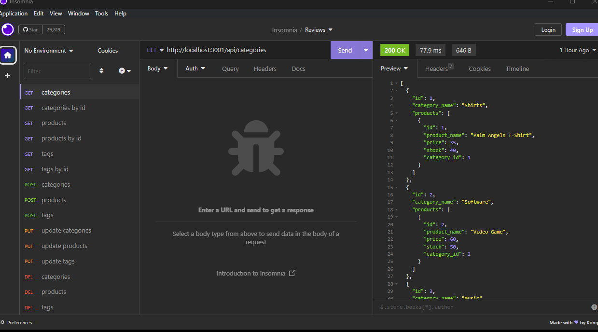

# E-commerce-back-end

## Description

This is a basic back-end application for an e-commerce website created using starter code from the below repo:

https://github.com/coding-boot-camp/fantastic-umbrella

## How it works ?

This project uses Node, MySQL2, Express, Sequelize and dotenv. To insure that all dependencies are installed:

1. Run `npm i` before then starting the server
2. log in to mysql via `mysql -u root -p` and run `source db/schema.sql`
3. Next seed our data via `npm run seed`
4. Run `node server` to start exploring at `http://localhost:(your_port)/`

## Demo

Demo: https://drive.google.com/file/d/1_xz82eekFAla4KMYaWxSCZPGNMpNuwLz/view?usp=sharing

Feel free to test endpoints using Insomnia after running the server. Sample endpoint: "http://localhost:3001/api/categories" (GET request)

## Credits

Sameer Mirza | Columbia Coding Bootcamp
